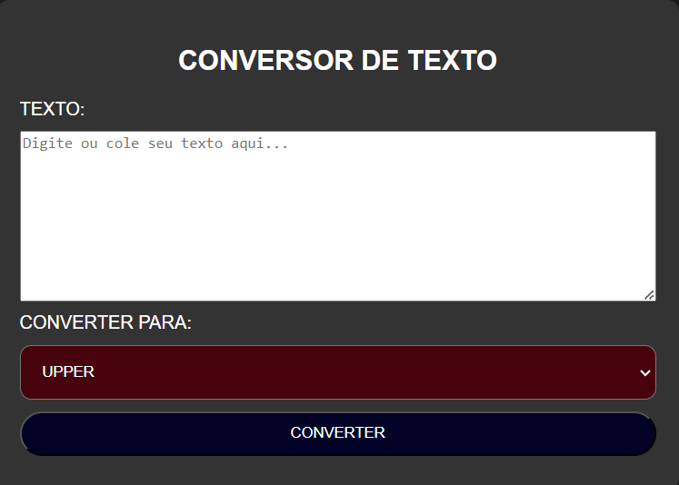
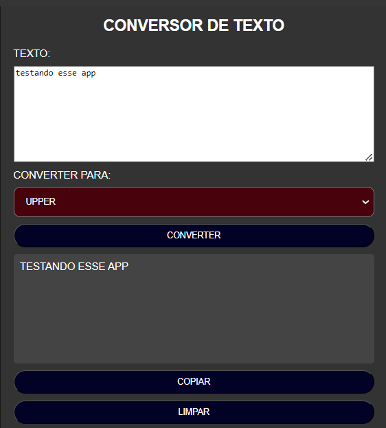

# CONVERTER UPPER
🐱‍👤USE O JAVASCRIPT PARA TRANSFORMAR SEU TEXTO EM UPPER, LOWER OU MISTO.

 <br><br>
 <br>

## DESCRIÇÃO:
O objetivo deste projeto é oferecer uma ferramenta prática para converter texto em letras maiúsculas, minusculas ou misturado. Aqui estão as principais funcionalidades implementadas:

1. **Converter Texto:**
   - Permite ao usuário inserir ou colar um texto no campo de entrada.

2. **Selecionar Tipo de Conversão:**
   - Permite ao usuário selecionar o tipo de conversão desejado: `UPPER` (maiúsculo), `LOWER` (minúsculo) ou `MISTO` (iniciais em maiúsculo).

3. **Converter:**
   - Ao clicar neste botão, o texto inserido é convertido de acordo com o tipo selecionado e exibido no campo de texto convertido.
   - O botão `LIMPAR` ao lado do botão `COPIAR` também é exibido nesta etapa.

4. **Limpar:**
   - Ao clicar neste botão, o campo de texto de entrada é limpo, o campo de texto convertido é oculto e os botões `LIMPAR` e `COPIAR` também são ocultos.

5. **Copiar:**
   - Ao clicar neste botão, o texto convertido é copiado para a área de transferência do usuário.
   - Uma mensagem de confirmação é exibida temporariamente para indicar que o texto foi copiado com sucesso.

## COMO USAR?
### BAIXANDO O PROJETO:
* Clone o repositório para o seu sistema local:

```bash
git clone https://github.com/VILHALVA/CONVERTER-UPPER.git
```

* Navegue até o diretório do projeto.

```bash
cd CONVERTER-UPPER
```

* Descompacte o arquivo ZIP (se você baixou manualmente):

```bash
unzip CONVERTER-UPPER.zip
```
* Abra o arquivo `CODIGO.html` em seu navegador de preferência.

### EXECUTANDO O PROJETO:
1. **Inserir Texto:**
   - Digite ou cole o texto que deseja converter no campo de entrada.

2. **Selecionar Tipo de Conversão:**
   - Escolha entre `UPPER` (maiúsculo), `LOWER` (minúsculo) ou `MISTO` (iniciais em maiúsculo) no menu suspenso.

3. **Converter o Texto:**
   - Clique no botão `CONVERTER` para realizar a conversão de acordo com o tipo selecionado.
   - O texto convertido será exibido no campo correspondente abaixo.

4. **Limpar o Campo:**
   - Se desejar limpar o campo de entrada e o texto convertido, clique no botão `LIMPAR`.
   - Isso ocultará o campo de texto convertido e os botões `LIMPAR` e `COPIAR`.

5. **Copiar o Texto Convertido:**
   - Após a conversão, clique no botão `COPIAR` para copiar o texto convertido para a área de transferência.
   - Uma mensagem de confirmação será exibida temporariamente para indicar que o texto foi copiado com sucesso.

## NÃO SABE?
- Entendemos que para manipular arquivos em `HTML`, `CSS` e outras linguagens relacionadas, é necessário possuir conhecimento nessas áreas. Para auxiliar nesse aprendizado, oferecemos cursos gratuitos disponíveis:
* [Curso de HTML e CSS](https://github.com/VILHALVA/CURSO-DE-HTML-E-CSS)
* [Curso de JavaScript](https://github.com/VILHALVA/CURSO-DE-JAVASCRIPT)
* [Confira mais cursos](https://github.com/VILHALVA?tab=repositories&q=+topic:CURSO)

## CREDITOS:
- [PROJETO CRIADO PELO VILHALVA](https://github.com/VILHALVA)
- [ESTÁ DISPONIVEL NO SITE](https://vilhalva.github.io/STYLER/STYLER.html)
